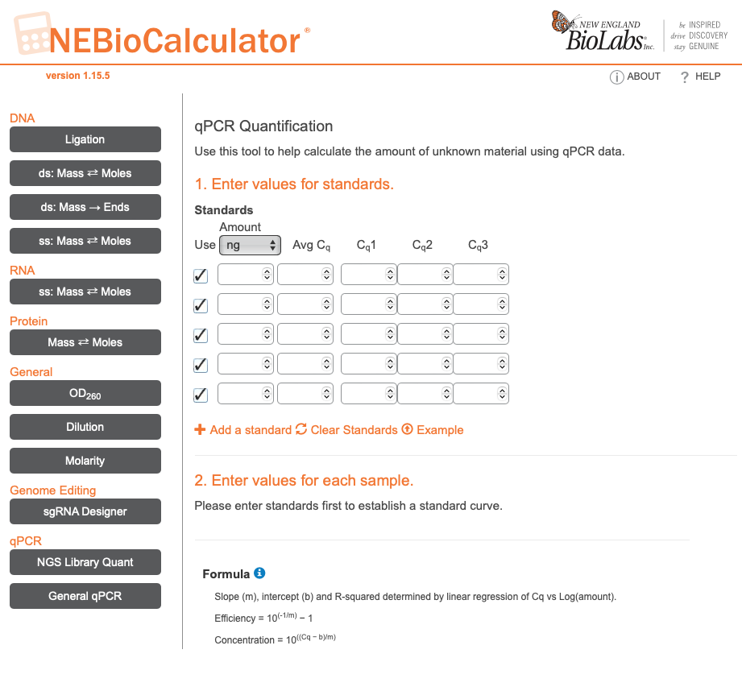
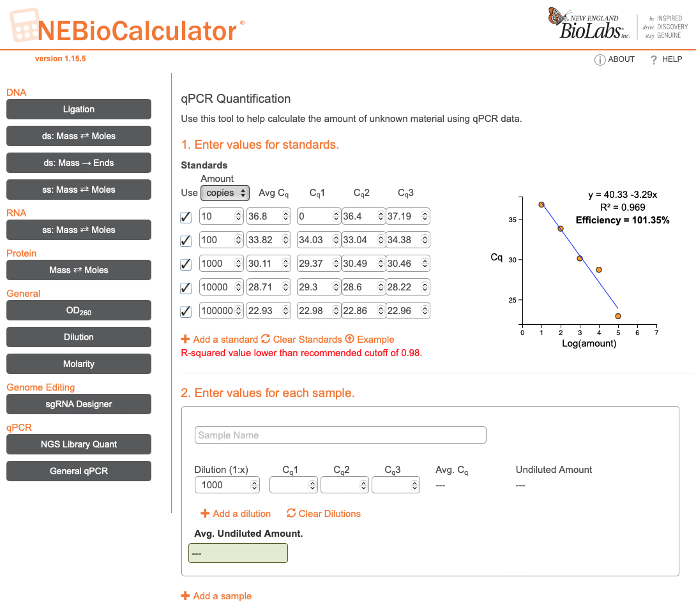
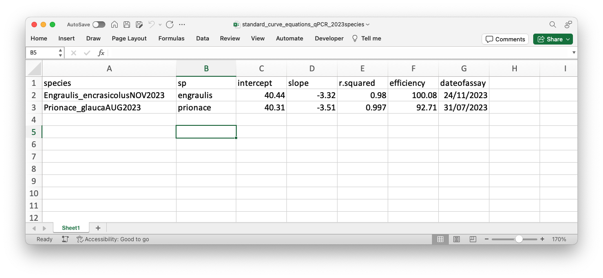

# Calculating Copy Number from qPCR Cq values
To calculate the number of copies in a sample given the Cq value of a replicate, you need (1) diluted species-specific standards ranging from 1million &micro;L to 1&micro;L concentrations, (2) a standard curve test assay for your species specific standard dilutions, (3) the NEBio online calculator, and (4) R code. 

## Step (1) Standards dilution
 Dilution of species-specific standards is well outlined in our [protocol for diluting standards](https://github.com/MollyKressler/CornishBlue-eDNA-Molecular-Lab-Protocols/blob/main/diluting-%20species-standards-for-qPCR.md).

## Step (2) Standard Curve Test Assay
This protocol is very lightly adapted from this [Genner lab protocol](https://github.com/genner-lab/Molecular-Lab-Protocols/blob/868019ebafdb5e1de031877ad83f4aa89867e397/tilapia-qpcr-assays.md). Adapted with help from Andy Saxon, November 2023. Relevant parts are copied and modified below.

*The following protocol is for a 46-well plate layout. DOUBLE volumes of reagents and samples/standards for a 96-well plate layout. Consumables are listed in Appendices below.*
#### Equipment required
* qPCR machine
* Laptop computer with qPCR software
* Pipettes and filtered pipette tips (10-20 &micro;L, 200 &micro;L, 1000 &micro;L)
* 1.5 mL microcentrifuge tubes
* Bench-top vortex
* Bench-top tube spinner
* Plastic tube racks
* Plastic sample boxes
* Lab note book
* 10% bleach in squeezy wash bottle 
* 70% ethanol in squeezy wash bottle
* Paper towels
* Disposible gloves
  
#### Reagents and aliquots required:
* [IMPORTANT NOTE] These reagents need to be stored frozen in dedicated boxes at -20&#176;C when not in use, and to avoid cross contamination the eDNA samples and amplification standards need to be stored in separate boxes from the assay reagents and from each other.
* Chai Bio Sahara Hot Start PCR Master Mix
* Nuclease free "ultrapure" water in 1 mL aliquots
* TE buffer in 1 mL aliquots
* Premixed primer+probe (PPM) in 50 &micro;L aliquots
* Assay quantification standards at 100k, 10k, 1k, 100, 10, & 1 copy/&micro;L stock solution

#### Before each experiment:
* Wipe down the bench surfaces with 70% ethanol followed by 10% bleach, followed by 70% ethanol (the "EBE" clean). Do NOT bleach the qPCR machine.
* Ensure you have sufficient gloves, tips, tip disposal jars, tubes etc.
* Ensure all reagent working stocks are sufficient and defrosted.

#### Preparing the primer and probe stocks
* Primers and probes can be premixed in advance in order to save time and reduce risk of master stock contamination.
* Primers and probes are shipped dry and must be reconstituted with TE Buffer  to 100 &micro;M stocks following synthesis instructions enclosed with the order.
* These 100 &micro;M stocks should be divided into several 20 &micro;L aliquots to minimise contamination risk.
* Probes are sensitive to light, and should be kept in the dark were possible while defrosted on the lab bench.
*  PPM aliquots can then stored in the freezer and used as required.

#### Plate preparation
1. In a clean 1.5 mL microcentrifuge tube prepare a mix sufficient for 16 PCR reactions of 10 &micro;L.
2. We prepare enough reagents for 17 reactions here, to account for any loss from pipetting error and evaporation.
3. The combined reagents are premixed and added to every tube, but the quantification standards and negative PCR controls are each added individually according to the well layout above.

| Added | Reagent | Volume x 1 (&micro;L) | Volume x17 (&micro;L) |
| :--- | :--- | ---: | ---: |
| combined | Sahara Hot Start PCR Master Mix | 5 | 85 |
| combined | primer+probe mix | 0.5 | 8.5 |
| combined | ultrapure water | 3.5 | 59.5 |
| individually | sample/standard/control | 1 | NA |

4. Vortex to mix the 'combined' reagents well
5. Add 9 &micro;L of this combined reagents mixture to each 0.1 mL PCR tube well (for a 46-well plate).
6. Put away all reagent stocks back in the freezer before handling the eDNA samples or quantification standards.

#### Adding the controls & quantification standards 
1. To the Negative Control "-" well, in a 46-well plate this is typically F8, add 1 &micro;L of ultrapure water. 
2. To the Standards "S" wells, typically wells A1-F4, add 1 &micro;L of DNA quantification standard at the appropriate concentration. The columns are labelled A-F and the Rows 1-6 in a 46-well plate. The plate should be laid out with one column per Standard concentration, and four replicates per concentration, going from most concentrated on the left to least concentrated on the right. For example, A1-4 should be the 100k concentration Standard, and F1-F4 should be the 1 concentration Standard. After adding the 10k concentration Standard to C1-C4 change gloves. 
4. Cut a qPCR cover sticker to size and place over the top, being careful tot not move the sticker once laid as this will immediately contaminate all wells. 
5. Vortex and salad spin the plate until there are no bubbles at the bottom of the wells. Bubbles elsewhere are not ideal but fine, but bubbles at the bottom are not okay. 
6. These are now ready for loading onto the machine.

#### Setting the thermocycling conditions
1. Start up protocols will vary by machine, but start a new experiment. 
2. Make sure to set the cycle length to a maximum of 40 cycles. 

#### Setting well layout 
1. On the software, under the new experiment, navigate to the plate layout page. 
2. Define the Standards, as described above with the number of copies, in thousands, from 100,000 (100k) to 1 copies (0.01k).
3. Classify well F8 as NTC.
4. On the Well layout page, highlight cells A1-A4 and classify as 100k standard from the Sample drop-down menu. 
5. Choose "S" (standard) from the Type menu, and manually enter "100000" into the set quantification to 100,000 copies.
6. . Repeat Steps 4 & 5 for all quantification standards down to 10 copies. Be sure to check they match with the names given and have the correct number of zeros.
8. Add an additional well (F8) as a negative PCR control (Type "-"). 

#### Running the qPCR
1. Open the machine and place the sealed well plate into position - lining up the notched corner of the plate with the notched corner of the plate holder. 
2. Close the machine lid.
3. On the laboratory laptop, in the qPCR software in the Experiment where you defined the well layout, press 'Start Experiment'. 
4. On the Amplification Curve tab, you can watch the amplification in real time. It may take many cycles for any of the curves to move above zero, so don't worry. 

#### End of qPCR Experiment
1. When the experiment has finished running the software will have saved a file with the name of the experiment to the folder you designated when defining the experiment.
2. You can open this to check it saved. 
3. On your dominant hand, put on a glove, and ppen the lid of the qPCR machine - caution: the interior of the machine may still be hot. 
4. Press the latch to release the plate, and lift the plate from the holder - this may be tacky and hot. 
5. With the plate out and in your gloved hand, remove your glove around the plate, and tie the glove off - much like a dog poop bag. Place the wrapped plate into the laboratory waste bin. 
6. In the saved and opened experiment file, click 'Export' and save the datafile to a flashdrive. Choose the option to save it as an Excel/xlsx file.

## Step (3) Interpreting the Standard Curve Test Assay calculating the Standard Curve with NEBio Calculator
1. In the exported experiment file, navigate to the Results tab. Form this page you'll need the Cq values for each Standard. 
2. On a web browser, go to the [NEBio online calculator](https://nebiocalculator.neb.com/#!/qPCRGen), and navigate to the General qPCR tab on the left hand menu. 

|  |
| :---: |

3. Set the Standards Amount unit to the appropriate unit - for this protocol, the appropriate unit is copies. 
4. In the first column of the table, list the Standards concentrations from 100k to 10, one per row, adding rows as needed by clicking '+ Add a Standard'.
5. Skipping the second column, headed 'Avg Cq', into the third, fourth and fifth columns put the Cq values for the corresponding standard. Because we ran each Standard in quadruplicate you can select the three Standards wells for a given concentration, e.g 100k, that are most aligned. For example, if the four Cqs for 100k were 21.567, 22.483, 21.548, and 22.976, you might pick the first three to include and exclude the fourth value (22.976). This is perfectly valid. 
6. The table will automatically calculate the Avg Cq for each standard, and will plot a standard curve to the right of the table. You can include/exclude standards by clicking or deselecting the box to the left of the Standards copies column - here I've deselected the 10k Standard because it appears that something was not quite right in that dilution, and it's affecting the R^2^ and efficiency of the curve. This is a valid approach. You want an R^2^ > 0.99, and an Efficiency between 90-110%. And you can see here that by dropping the 10k Standard, both those values are within a 'good' range.

|  |
| :---: |

7. When you've completed the table a second section will appear where you can manually enter your samples Cqs or Cq.Means. But this is tedious and prone to manual entry error. Instead Step 4 illustrates how by you can define a tidyR workflow to calculate this for whole output files. 
8. For Step 4 you need an excel or data file with the standard curve information from the NEBio calculator. You want to 'grab' the test/experiment name, the intercept, slope, R^2^ value, and efficiency, as well as the date of the assay. If you have standard curve test assays for multiple species you can include these in one data frame with one row for each species. I'll refer to this file as your 'neb' file from here on. It's important that the data frame has a reference column like 'sp' (aka species), both for your records but also to allow you to select the specie-specific row of the data frame if you have multiple species stored in the one file. 

|  |
| :---: |

## Step (4) tidy R code for calculating copies of DNA from Cq mean values using NEBio calculators standard curve estimates 
1. In addition to having completed Steps 1-3 from this protocol you will need to have run field samples through the [qPCR protocol](https://github.com/MollyKressler/CornishBlue-eDNA-Molecular-Lab-Protocols/blob/main/cornishblue-qpcr-assays.md), saved the experiment results as xlsx, and transformed them in R into data frames organised such that each row is one sample with the 'Cq.Mean' value and 'Assay.Role' for all the replicates of that sample (three replicates, if you followed the protocol), with samples identified by 'Sample.Name'. I'll refer to this data frame as your 'data' from here on.
2. The following R code will calculate the number of copies in each field sample of your data, and assign them to a new column labelled 'species.copies'. I recommend modifying this to have your study species replace 'species', e.g. if you study blue sharks you could set 'species.copies' to 'pglauca.copies'. 
**Note:** The units of 'yourspecies.copies' will depend on the concentration of your standards and your qPCR protocol. Following the [qPCR protocol](https://github.com/MollyKressler/CornishBlue-eDNA-Molecular-Lab-Protocols/blob/main/cornishblue-qpcr-assays.md), the [protocol for diluting standards](https://github.com/MollyKressler/CornishBlue-eDNA-Molecular-Lab-Protocols/blob/main/diluting-%20species-standards-for-qPCR.md), and this protocol, should yield copy numbers at a concentration of 'n' copies/&micro;L.  

```{r}
pacman::p_load(dplyr,lubridate,readr,readxl,lubridate,stringr) # pacman is a package to allow for multuple package upload an update within one line. 

#################################
## - Tidy NEBio Calculator results from Standard Curve Tests  
#################################

## import excel sheet with numbers 

	neb <- read_excel('yourstandardcurveResultsfile.xlsx',.name_repair = 'universal', col_types = c('text','text','numeric','numeric','numeric','numeric','date'))%>%
		mutate(dateofassay=as_date(dateofassay)) 
		# '.name_repair' argument converts spaces in header names to '_'	
		# 'col_types' argument tells read_excel what the structure of each variable is. If you set up your neb file as I show above, this will be the appropriate code. If not you may need to modify what is 'text', 'numeric', and 'date'.
		
	neb # check to see it loaded correctly

#################################
## - Calculate Copies   
#################################

## import species tidyed qPCR results 

	data <- read.csv('data.csv')%>%
		as_tibble()%>%
		mutate(Cq.Mean = as.numeric(Cq.Mean))
		
	data # check - are the headers as described above? 
	
	## We need to separate out the standards and negative controls bc they get lost in the grouping and slicing because of common naming of standards across test assays.
	
	controls_data <- data%>%filter(Assay.Role != 'Unknown') # this now holds all tests positive controls (standards of known concentrations) and negative controls (purified water).
	
	data <- data %>% filter(Assay.Role == 'Unknown') # this now holds the test results for all replicates without the controls.

##### Define function 
## using NEBio standard curve equation (species specific)

	calculate_copies <- function(intercept, slope, Cq.Mean) {
		copies <- 10^((Cq.Mean - intercept)/slope)
		return(copies)
		}

##### Apply function 
## to data and controls separately, to calculate the number of copies per unit of sample

	data2 <- data %>%
		group_by(Sample.Name) %>%
		slice_head()%>% ## first: need to filter down to only one row for each replicate and use the Cq mean
		mutate(intercept = as.numeric(neb %>% filter(sp == 'yourspecies') %>% select(intercept)),
			slope = as.numeric(neb %>% filter(sp == 'yourspecies') %>% select(slope)), 
			r.squared = as.numeric(neb %>% filter(sp == 'yourspecies') %>% select(r.squared)), 
			efficiency = as.numeric(neb %>% filter(sp == 'yourspecies') %>% select(efficiency)))%>% # bring in the standard curve information and statistics
		mutate(yourspecies.copies = calculate_copies(intercept, slope, Cq.Mean))%>% # calculate copies using linear formula
		replace_na(list(yourspecies.copies = 0)) # where Cq.Mean was NA, and therefore copies is NA, replace with a 0. 
		
		summary(data2) # NAs are fine in Cq.Mean and Cq because they are from samples that never amplified (i.e. they have no detectable traces of that species). In the pipe above, the final line adjusts the copies estimate to 0 for these cases.

	controls_copies <- controls_data %>%
		mutate(intercept = as.numeric(neb %>% filter(sp == 'yourspecies') %>% select(intercept)),
			slope = as.numeric(neb %>% filter(sp == 'yourspecies') %>% select(slope)), 
			r.squared = as.numeric(neb %>% filter(sp == 'yourspecies') %>% select(r.squared)), 
			efficiency = as.numeric(neb %>% filter(sp == 'yourspecies') %>% select(efficiency)))%>% # bring in the standard curve information and statistics
		mutate(yourspecies.copies = calculate_copies(intercept, slope, Cq.Mean))%>% # calculate copies using linear formula
		replace_na(list(yourspecies.copies = 0)) # where Cq.Mean was NA, and therefore copies is NA, replace with a 0. 
		

## Save files  
	write.csv(data2, 'copies_perReplicate_notStandards_YOURSPECIES_WHICHASSAYS_MONTHYEAR.csv')
	write.csv(controls_engraulis, 'resultsANDcopies_perStandard_andNegControl_YOURSPECIES_WHICHASSAYS_MONTHYEAR.csv')

```


### Appendices
###### Suppliers and part numbers
For a 46-well plate machine, order different and appropriate well plates and rack.

| Type | Item | Supplier | Part no. |
| :--- | :--- | :--- | :--- |
| equipment | Open qPCR machine |
| equipment | Pipette starter pack (4x pipettes) | Starlab UK | STARTERPACK42.5 |
| equipment | Vortamix Mini Vortexer | SLS | ARG1878 |
| equipment | Mini Fuge tube spinner | SLS | N2631-0017 |
| equipment | 250 mL wash bottle | SLS | BOT9000 |
| equipment | 96-well 1.5 mL microcentrifuge tube rack | Starlab UK | I2396-5048 |
| equipment | 96-well 0.2 mL PCR tube rack | Starlab UK | E2396-5240 |
| equipment | 81-tube freezer storage box | Starlab UK | I2381-5040 |
| consumable (plastic) | 10/20 &micro;L pipette filter tips | Starlab UK | S1120-3710 |
| consumable (plastic) | 200 &micro;L pipette filter tips | Starlab UK | S1120-8710 |
| consumable (plastic) | 1000 &micro;L pipette filter tips | Starlab UK | S1122-1730 |
| consumable (plastic) | 1.5 mL microcentrifuge tube | Starlab UK | S1615-5510 |
| consumable (reagent) | Chai Bio Sahara Hot Start PCR Master Mix | Chai Bio | R02151M |
| consumable (reagent) | Nuclease-free ultrapure water | Thermo Fisher Scientific | 10977035 |
| consumable (reagent) | qPCR assay primers and probes | Eurofins Genomics | as required |
| consumable (reagent) | TE Buffer | Thermo Fisher Scientific | 12090015
