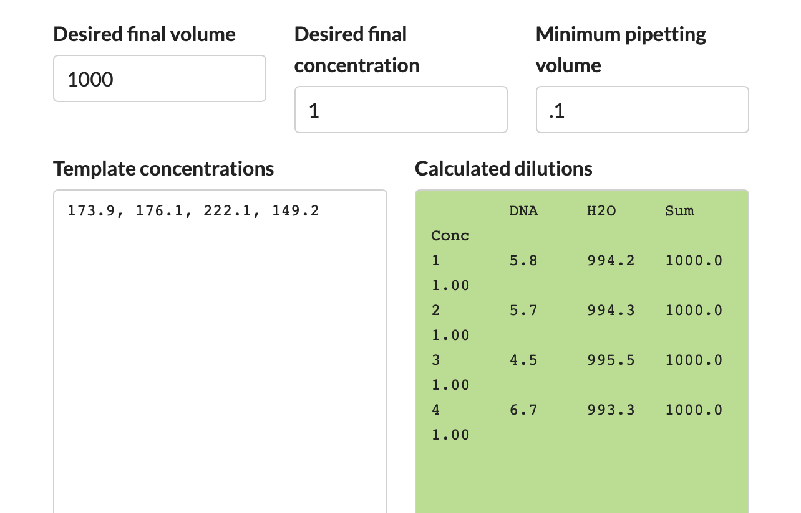

## Adapted from Genner Lab's tilapia qPCR protocol 
[https://github.com/genner-lab/Molecular-Lab-Protocols/blob/868019ebafdb5e1de031877ad83f4aa89867e397/tilapia-qpcr-assays.md]

#### Created by Rupert Collins, Andy Saxon, Martin Genner :: March 2022
#### Adapted and used by Molly Kressler, Lucy Whitelegg and Andy Saxon :: November 2023 

### Appendix 3

#### Oligonucleotide sequences for quantification standards

| Species | Base pairs | Common name | Oligonucleotide sequence (5&prime; -> 3&prime;) |
| :--- | :--- | :--- | :--- |
| _Lamna nasus_ | 109  | porbeagle | TGA ACG GTT TAC CCT CCC CTA GCT GGC AAC TTA GCA CAT GCC GGG GCC TCC GTT GAT CTG GCT ATC TTT TCC CTT CAC CTA GCG GGT ATC TCT TCA ATC TTA GCT TCA A |
| _Engraulis encrasicus_ | 111 | Euro anchovy |  CAT TCT AAT CGG TGG GTT CGG GAA TTG ACT AGT TCC TCT TAT ACT AGG GGC CCC AGA CAT GGC ATT CCC CCG AAT GAA CAA TAT GAG CTT TTG ACT CCT TCC TCC TTC TTT  |
| _Sprattus sprattus_ | 88  | sardine | ACT GAC TAG TTC CCC TCA TGG TCG GAG CAC CAG ATA TGG CAT TCC CTC GAA TAA ACA ATA TGA GCT TCT GAC TAC TCC CTC CCT CAT T  |
| _Alopias vulpinas_ | 131 | common thresher | TTA GCT GAC TAG CAA CTC TCC ACG GGG GCT CCA TTA AAT GAG AGA CCC CAT TAC TAT GAG CTC TCG GAT TCA TTT TCT TAT TCA CAG TAG GAG GTT TAA CAG GTA TCG TCT TAG CCA ACT CCT CCT TAG AT  |

#### Diluting quantification standards

* [IMPORTANT NOTE] the standards are supplied dried and HIGHLY concentrated, and must be prepared in a separate area and using separate pipettes to those used for DNA extraction and PCR reaction preparation. Bleach the area thoroughly after use.
* All traces of them must be kept seperate from the other reagents because they are indistinguishable from real tilapia DNA and can lead to severe false positive contamination problems.
* Always use TE buffer to dilute the stocks of quantification standards. Ultrapure water can be used for serial dilutions as these will be discarded after use.
* Prepare the standards as follows (initial steps only need to be done once):

1. Spin down the supplied oligo tubes to collect the dried oligonucleotides.
2. Follow the Synthesis Report for quantities of TE buffer to add to oligonucleotides, for the target dilution of 100 pmol/&micro;L. For the four species above add the following:

| Species | TE Buffer Vol. |
| :--- | :--- |
| _Lamna nasus_ | 82 &micro;L  | 
| _Engraulis encrasicus_ | 147 &micro;L |
| _Sprattus sprattus_ | 278 &micro;L  | 
| _Alopias vulpinas_ | 40 &micro;L | 

3. Incubate for 5 min at room temperature, and vortex for 1 min.
4. Use the online [NEBioCalculator ssDNA Convertor](https://nebiocalculator.neb.com/#!/ssdnaamt) to calculate the mass of single-stranded DNA given the molarity.
5. Select the "Moles -> Mass" tab, and paste the full DNA sequence (from table above), and set the DNA moles to 100 pmol.
6. The result is a DNA mass of 2.132 &micro;g/&micro;L (= 2132 ng/&micro;L).

|  |
| :---: |

7. Now move to the "Mass -> Moles" tab and insert the DNA mass of 2.132 &micro;g.
8. The result is a DNA copy number of 6.021e+13 (or 60 trillion, 210 billion) copies per microlitre.

|  |
| :---: |

9. To make a 10 ng/&micro;L stock in 1 mL volume, add x &micro;L of 100 pmol/&micro;L stock to 1000-x &micro;L water, and vortex thoroughly.
10. Use an [online dilution calculator](http://www.desiquintans.com/dilutioncalc) as follows: 

|  |
| :---: |

11. Recalculate the DNA copy number of this 10 ng/&micro;L stock (e.g. = 1.761e+11 copy/&micro;L).
12. Calculate the third dilution: take the new copy number from step 11 (but in billions format, e.g. 1.76e+11 = 176.1 billion), and enter that into the online concentration calculator, and reduce the desired final concentration to 1. Now make the third diluation down to a 1 billion copy/&micro;L stock by adding y &micro;L of 10 ng/&micro;L stock to 1000-y &micro;L water, as described in the green table, and vortex thoroughly.

|  |
| :---: |

13. These stocks should be frozen and kept in different boxes to the PCR reagents.
14. The fourth stage dilution creates 100 &micro;L dilutions of ecreasing concentraiton by an order of mangitude. Prepare 7 ependorfs with 90 &micro;L of water.
15. Into the first eppendorf, pippette 10 &micro;L of the third stage dilution (the 1 billion copies dilution). Vortex this throughly.
16. From the first eppendorf, pipette 10 &micro;L, and dispense into the second eppendorf of 90 &micro;L H2O. Vortext thoroughly. Repeat this sequence for all eppendorfs to create 100 &micro;L dilutions of 1mill, 100k, 10k, 1k, 100, 10, 1 copies.
17. Store these outside the DNA Clean Room. 

### Dilutions for four target species 
| Species | Base Pairs | 2nd dilution, 10 ng/&micro;L | 3rd dilution, 1billion copies |
| :--- | :--- | :--- | :--- |
|  |  | Ratio Pure to Water, copies |  Ratio 2nd dilution to Water |
| _Lamna nasus_ | 109 | 3&micro;L : 997&micro;L, 1.793E+11 |  5.8&micro;L : 994.2&micro;L |
| _Engraulis encrasicus_ | 111 | 2.9&micro;L : 997.1&micro;L, 1.761e+11 |  5.7&micro;L : 994.3&micro;L |
| _Sprattus sprattus_ | 88 | 3.7&micro;L : 996.3&micro;L, 2.221e+11 |  4.5&micro;L : 995.5&micro;L |
| _Alopias vulpinas_ | 131 | 2.5&micro;L : 997.5&micro;L, 1.492e+11 | 6.7&micro;L : 993.3&micro;L |
