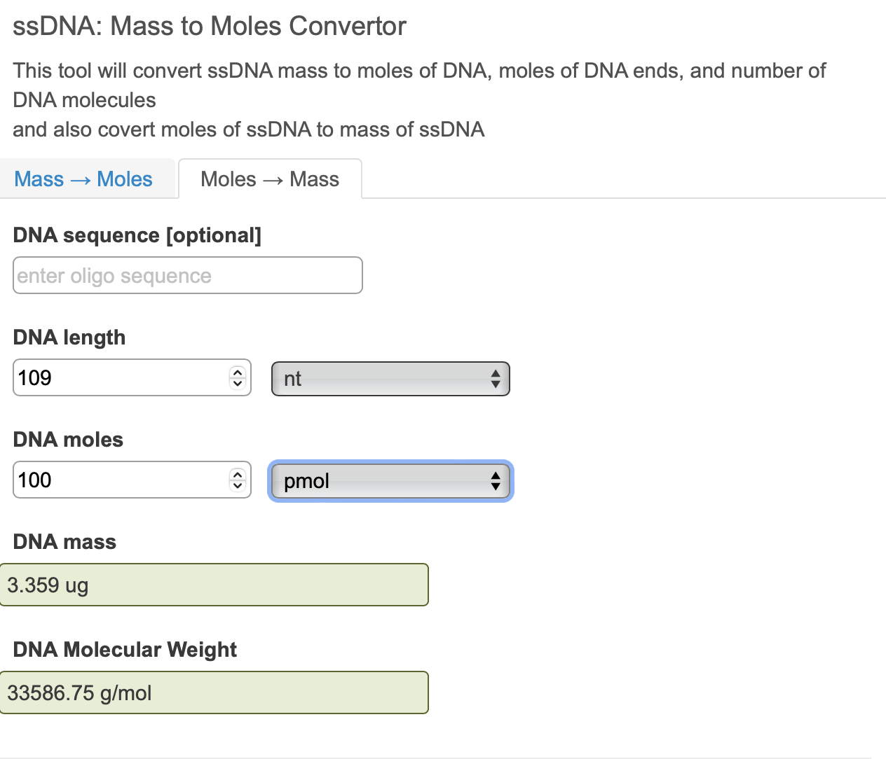

## Adapted from Genner Lab's tilapia qPCR protocol 
[https://github.com/genner-lab/Molecular-Lab-Protocols/blob/868019ebafdb5e1de031877ad83f4aa89867e397/tilapia-qpcr-assays.md]

#### Created by Rupert Collins, Andy Saxon, Martin Genner :: March 2022
#### Adapted and used by Molly Kressler, Lucy Whitelegg and Andy Saxon :: November 2023 

### Appendix 3

#### Oligonucleotide sequences for quantification standards

| Species | Assay | Base pairs | Oligonucleotide sequence (5&prime; -> 3&prime;) |
| :--- | :--- | :--- | :--- |
| _Oreochromis leucostictus_ | leuco | 70 | CTCTGCCCTACTGCACTCGAGCACCATAGTCGTAGCCGGCATCTTCCTTCTCATCCGTATAAGCCCCATG |
| _Oreochromis niloticus_ | nilo | 127 | TGGAGGTTTTACCCTACAGACCTTTAGCATTGCTCAAGAAAGTGTCTGACTAATCCTTCCCGCCTGACCTTTAGCCGCTATATGATACATTTCCACACTTGCAGAAACTAACCGAGCTCCCTTCGAC |
| _Oreochromis urolepis_ | uro | 95 | CTAAGCCTCGTGTTAACTCCAGTACCACAAACAACGTCAACAACAACACTCACGCCCCCAACACCAAAACACCTCCACCTGCCGAATACATCAAA |

#### Diluting quantification standards

* [IMPORTANT NOTE] the standards are supplied dried and HIGHLY concentrated, and must be prepared in a separate area and using separate pipettes to those used for DNA extraction and PCR reaction preparation. Bleach the area thoroughly after use.
* All traces of them must be kept seperate from the other reagents because they are indistinguishable from real tilapia DNA and can lead to severe false positive contamination problems.
* Always use TE buffer to dilute the stocks of quantification standards. Ultrapure water can be used for serial dilutions as these will be discarded after use.
* Prepare the standards as follows (initial steps only need to be done once):

1. Spin down the supplied oligo tubes to collect the dried oligonucleotides.
2. If shipped at 4 nmol, add 40 &micro;L of TE buffer to dilute to 100 pmol/&micro;L.
3. Incubate for 5 min at room temperature, and vortex for 1 min.
4. Use the online [NEBioCalculator ssDNA Convertor](https://nebiocalculator.neb.com/#!/ssdnaamt) to calculate the mass of single-stranded DNA given the molarity.
5. Select the "Moles -> Mass" tab, and paste the full DNA sequence (from table above), and set the DNA moles to 100 pmol.
6. The result is a DNA mass of 2.132 &micro;g/&micro;L (= 2132 ng/&micro;L).

|  |
| :---: |

7. Now move to the "Mass -> Moles" tab and insert the DNA mass of 2.132 &micro;g.
8. The result is a DNA copy number of 6.021e+13 (or 60 trillion, 210 billion) copies per microlitre.

|  |
| :---: |

9. To make a 10 ng/&micro;L stock in 1 mL volume, add x &micro;L of 100 pmol/&micro;L stock to 1000-x &micro;L water, and vortex thoroughly.
10. Use an [online dilution calculator](http://www.desiquintans.com/dilutioncalc) as follows: 

|  |
| :---: |

11. Recalculate the DNA copy number of this 10 ng/&micro;L stock (e.g. = 1.761e+11 copy/&micro;L).
12. Now make the third diluation, down to a 1 billion copy/&micro;L stock by adding y &micro;L of 10 ng/&micro;L stock to 1000-y &micro;L water, and vortex thoroughly.

|  |
| :---: |

13. These stocks should be frozen and kept in different boxes to the PCR reagents.
14. The fourth stage dilution creates 100 &micro;L dilutions of ecreasing concentraiton by an order of mangitude. Prepare 7 ependorfs with 90 &micro;L of water.
15. Into the first eppendorf, pippette 10 &micro;L of the third stage dilution (the 1 billion copies dilution). Vortex this throughly.
16. From the first eppendorf, pipette 10 &micro;L, and dispense into the second eppendorf of 90 &micro;L H2O. Vortext thoroughly. Repeat this sequence for all eppendorfs to create 100 &micro;L dilutions of 1mill, 100k, 10k, 1k, 100, 10, 1 copies.
17. Store these outside the DNA Clean Room. 

